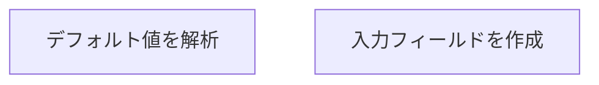

# flet-auto-method-gui

fletで動的にメソッド入力画面を生成

## 各クラスの役割



本モジュール（MethodAnalyzer, UIBuilderなど）と組み合わせるために、ユーザが定義するメソッド（以下、ターゲットメソッド）は、以下の条件を満たす必要があります。

1. 名前付き引数とデフォルト値をもつ関数であること

- ターゲットメソッドは、以下のように 名前付き引数（キーワード引数）をもち、デフォルト値が設定されている関数 として定義してください。

```python
def target_method(
    param1=default1,
    param2=default2,
    ...
)
```

- デフォルト値が指定されていない場合、GUI 側では入力欄が空の状態で表示されます。実装上の都合で必須引数（デフォルト値なし）を使用する場合も可能ですが、ユーザに入力を促す必要があるため推奨されません。

2. デフォルト値として扱える型
   1. 標準の組み込み型
    - str / int / float / bool などの Python 組み込み型。
    - None も許容されます。

   2. 本モジュール独自の型

    - `FileInput` : GUI 上に「ファイル選択ボタンとテキスト欄」が自動生成されます。
    - `ChoiceInput` : GUI 上に「ドロップダウンリスト」が自動生成されます。

    - これらをデフォルト値として指定すると、Flet UIBuilder が自動的に対応する入力フォームを生成します。
    
    ```python
    def target_method(
        file=FileInput("Select a file"),
        choice=ChoiceInput(["Option A", "Option B", "Option C"])
    ):
    ```

3. 標準出力の利用と制約
   1. 標準出力は GUI 上のテキスト欄に反映

    - print() で出力した内容は、モジュール内の StdoutRedirector によってフックされ、Flet GUI のテキスト欄に表示されます。
    - print(Figure) のように Figure を標準出力すると、Figure.__str__ が呼ばれ文字列表現として出力されるため、グラフ描画には用いないようにしてください。

   2. 標準入力の利用は非推奨

    - 本モジュールは Flet 上での GUI 入力を前提としているため、input() 等による標準入力は想定していません。

   3. コールバックやグローバル変数を用いる場合

    - ターゲットメソッドで「返り値を使わずに Figure を UI に送る」ような特殊な処理をしたい場合、以下の方法があります。

    - コールバック (Callback) を引数に受け取り、関数内で直接呼ぶ
    - 例: my_method(update_figure_callback=self.update_figure) のように指定し、メソッド内で update_figure_callback(fig) を呼び出す。

    - グローバル変数やクラス変数 に Flet UI のインスタンスを保持し、ターゲットメソッドが直接アクセスして update_figure(fig) を呼ぶ。
    - ただしこの方法は可読性や保守性の点でデメリットが大きいため、コールバック方式を強く推奨します。

